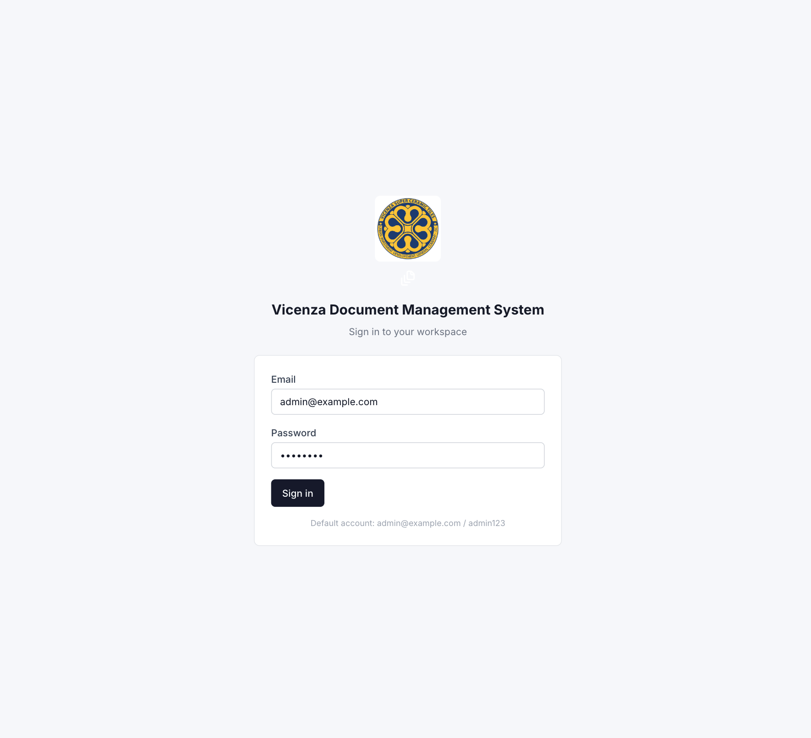
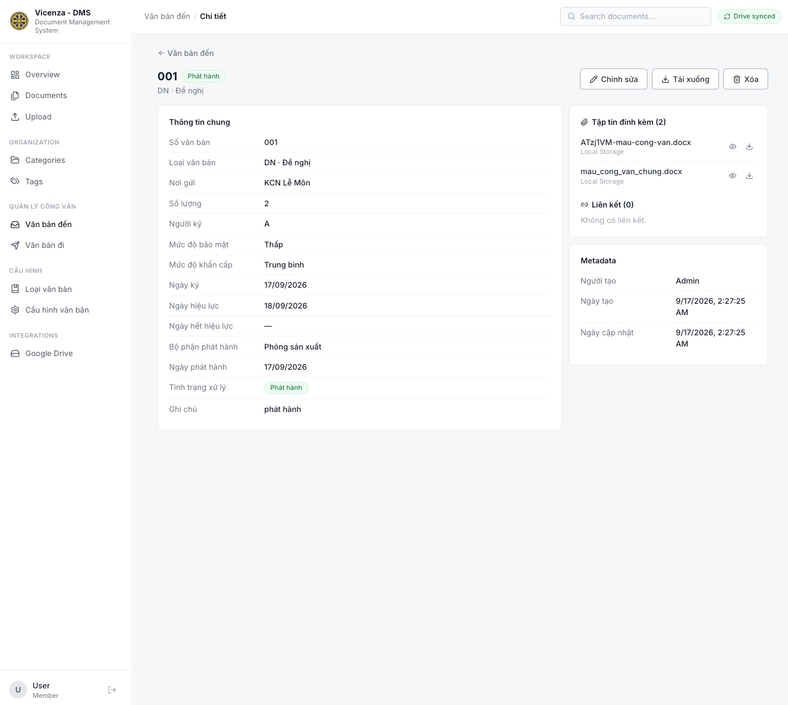
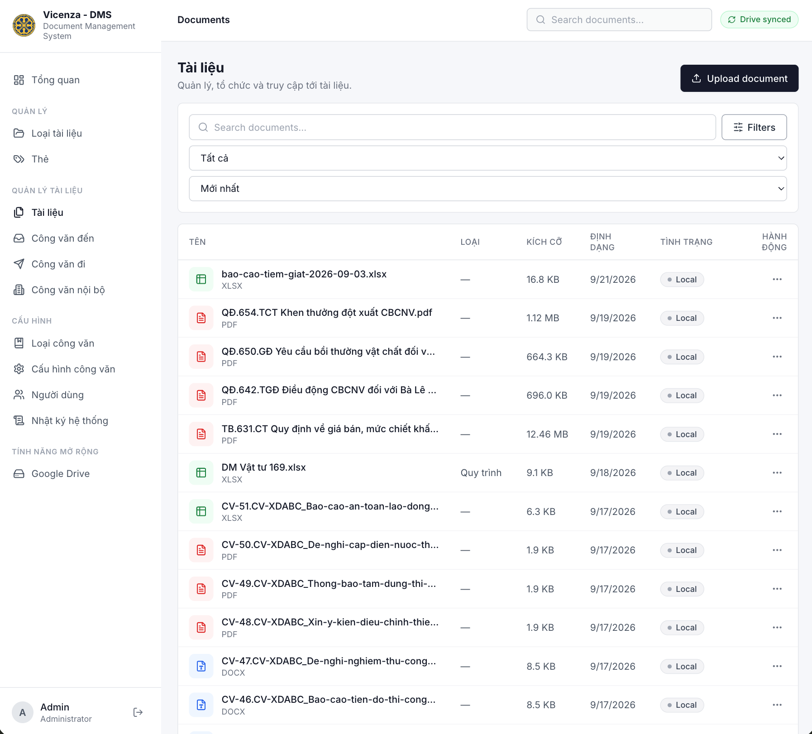
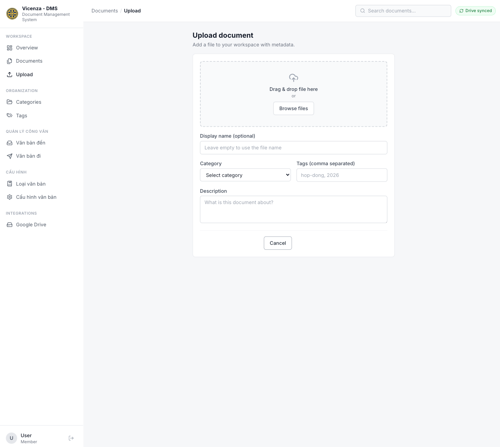
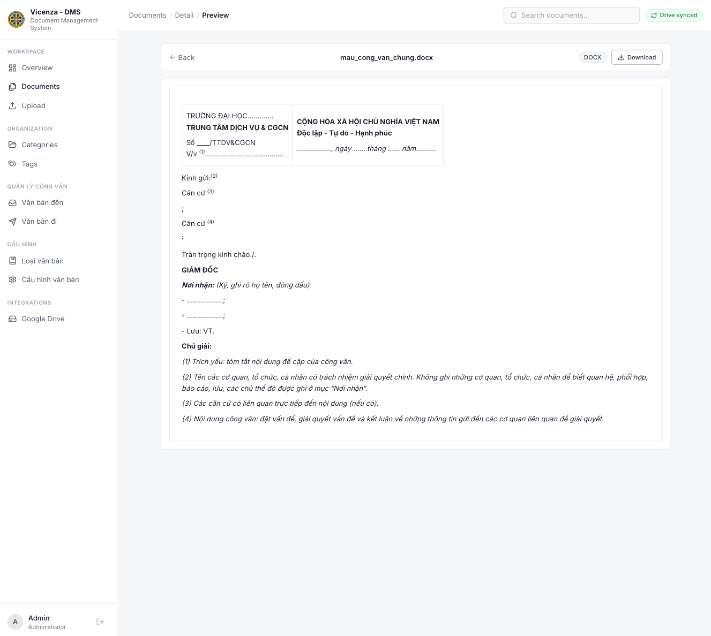
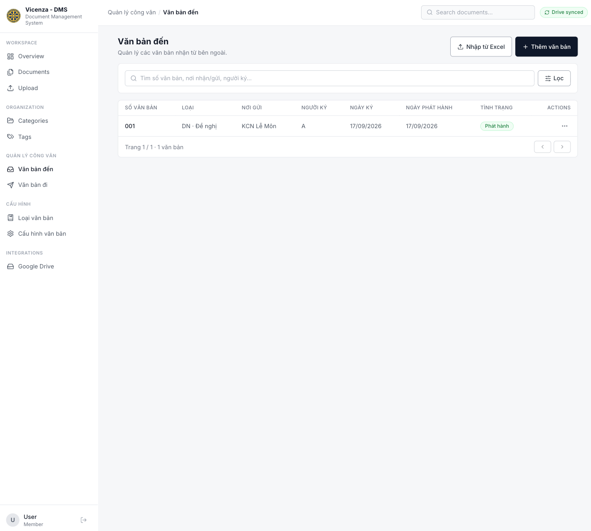
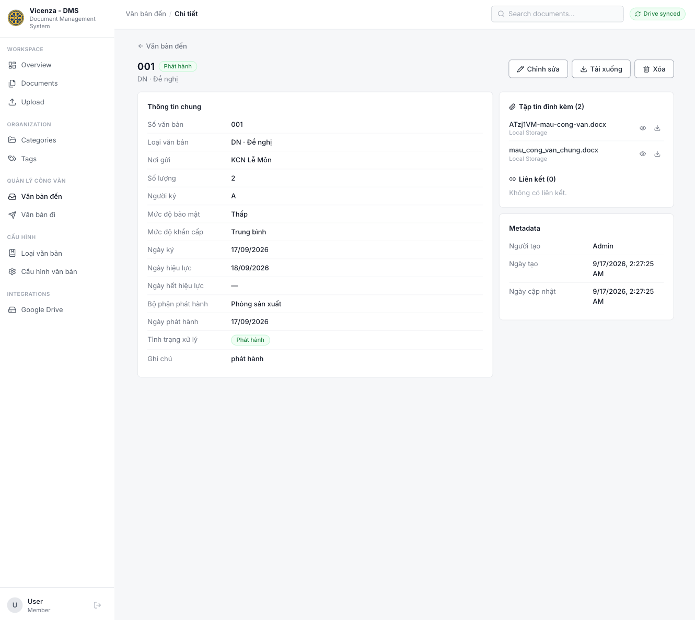
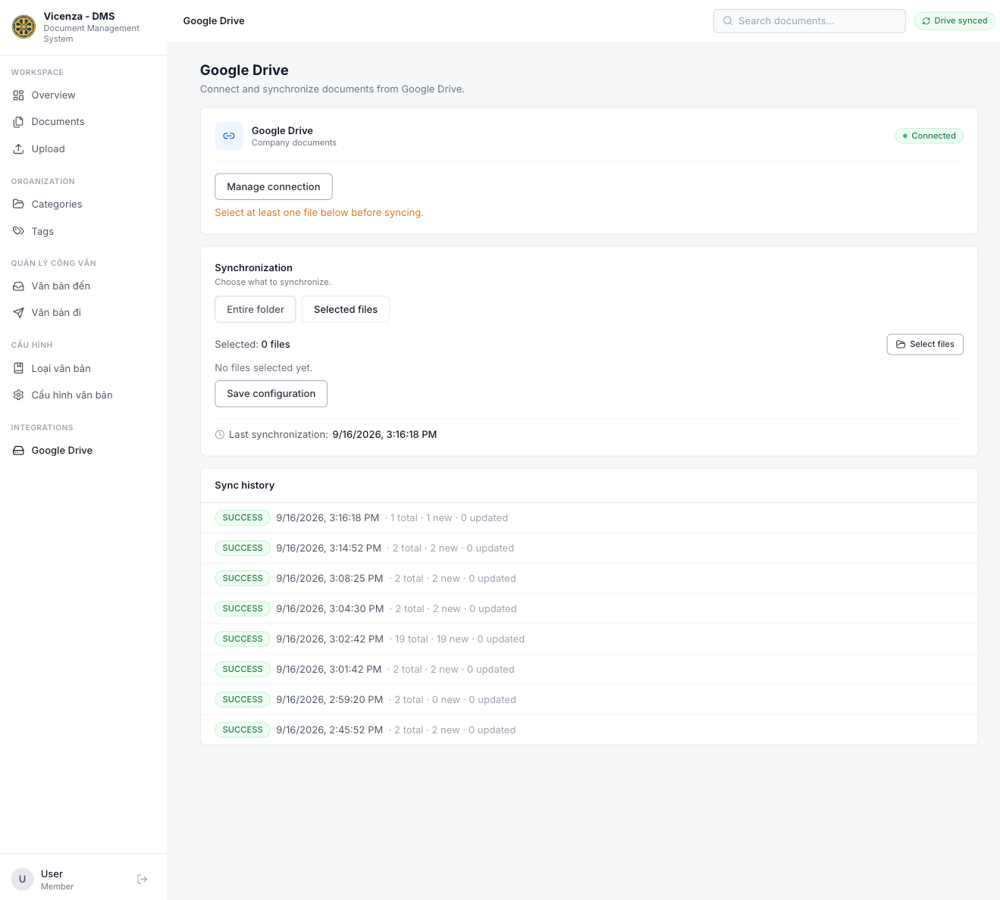

# 📁 Document Management System (DMS)

> **Hệ thống quản lý tài liệu & công văn điện tử**
> Quản lý tập trung tài liệu, công văn đến/đi/nội bộ, tệp đính kèm, phân loại, tìm kiếm và đồng bộ Google Drive.

---

## 📸 Project Preview

### Sign in



### Dashboard



### Document Management



### Upload



### Document Preview



### Correspondence Management





### Google Drive



---

## ✨ Overview

**Document Management System (DMS)** là hệ thống quản lý tài liệu nội bộ: số hóa lưu trữ, tra cứu tài liệu và quản lý công văn đến/đi/nội bộ trong doanh nghiệp.

- 📁 Quản lý tài liệu (upload/download/preview/metadata)
- 📥 Quản lý công văn đến / 📤 công văn đi / 🏢 công văn nội bộ
- 🏷️ Categories & 🔖 Tags
- 🔍 Tìm kiếm tiếng Việt (không dấu/có dấu, hoa/thường) + lọc + sắp xếp + phân trang
- 👁️ Preview trực tuyến (PDF, ảnh, TXT, CSV, XLSX, DOCX, Google Docs gốc)
- 📎 File đính kèm + 🔗 liên kết (tái dùng kho tài liệu)
- 📊 Import công văn từ Excel (template + preview + error report)
- ☁️ Đồng bộ Google Drive 1 chiều (cả folder / chọn từng file)
- 👤 Roles Admin/User + 🔐 JWT

---

# 🚀 Features

## 1. 📊 Dashboard

- KPI: tổng tài liệu, công văn đến/đi/nội bộ (số liệu thật từ `GET /api/dashboard/stats`)
- Bộ lọc thời gian: 7/30 ngày, tháng này, 3/12 tháng, tùy chỉnh — mọi biểu đồ cùng cập nhật
- Xu hướng công văn (line, 3 chiều), Top nơi gửi/nhận/bộ phận (bar ngang, Top 8)
- Tình trạng xử lý + bảo mật + khẩn cấp (donut, nhãn tiếng Việt)
- Loại văn bản (bar ngang Top 10), tài liệu gần đây, sync overview (Recharts)

## 2. 📁 Document Management

Upload (UUID filename, validate extension/MIME/size ≤100MB) · Download (kèm auth) · Preview · Sửa metadata (owner/admin) · Xóa (không xóa file gốc trên Drive) · Category/Tag · Search/filter/sort/pagination.

### Supported file types & preview

| File type                     | Preview                                               |
| ----------------------------- | ----------------------------------------------------- |
| PDF                           | ✅ PDF.js (chuyển trang, zoom, fit-width, fullscreen) |
| JPG / JPEG / PNG / WEBP       | ✅ (fullscreen)                                       |
| TXT                           | ✅ (monospace, giữ whitespace)                        |
| CSV                           | ✅ dạng bảng (giới hạn 200 dòng)                      |
| XLS / XLSX                    | ✅ nhiều sheet, dạng bảng (200 dòng/sheet)            |
| DOCX                          | ✅ qua Mammoth (read-only)                            |
| Google Docs/Sheets/Slides gốc | ✅ tự export sang PDF                                 |
| DOC (cũ), ZIP, PPTX, khác     | ⬇️ Download                                           |

## 3. 📥 Công văn đến / 4. 📤 Công văn đi / 5. 🏢 Công văn nội bộ

Công văn nội bộ dùng chung form, bảng, trạng thái, đính kèm, Excel import và loại văn bản với 2 chiều còn lại; trường đối tác là **Bộ phận/người nhận** (bắt buộc), không có Nơi gửi.

Fields: số văn bản (unique theo chiều), nơi gửi/nhận, số lượng, người ký, bảo mật/khẩn cấp (Thấp/TB/Cao), ngày ký/hiệu lực/hết hiệu lực/phát hành, bộ phận phát hành, loại văn bản, tình trạng (`Dự thảo/Đã duyệt/Trình ký/Phát hành`), ghi chú, đính kèm, liên kết, người tạo + ngày tạo/sửa.

Form dùng chung 2 chiều, 3 nút **Lưu và đóng / Lưu và thêm tiếp / Lưu và mở**, nút **Số mới** tự sinh theo cấu hình. Xóa có confirm; file đính kèm gốc luôn được giữ.

## 5. 📊 Import Excel

```text
Chọn file → Parse (SheetJS) → Validate headers/rows → Preview từng dòng
→ Confirm → Import (từng phần) → Result + error report xlsx
```

Validate cả client lẫn server: required, loại văn bản (theo mã/tên), enum, ngày (chấp nhận dd/mm/yyyy), trùng số trong file + DB. Tối đa 500 dòng.

## 6. 📋 Excel Template

Tải trực tiếp trong modal Import (sinh phía client): đủ 16 cột — Số văn bản, Nơi nhận/gửi, Số lượng, Người ký, Mức độ bảo mật, Ngày ký, Mức độ khẩn cấp, Ngày hiệu lực/hết hiệu lực, Bộ phận phát hành, Ngày phát hành, Loại văn bản, Tình trạng, Ghi chú, Liên kết tệp.

## 7. 🔍 Search & Filter

Tìm theo tên/mô tả/số văn bản/nơi gửi-nhận/người ký/loại/tag/bộ phận. Filter: category, tag, loại file, nguồn, sync status, tình trạng, khoảng ngày. Ô search giữ focus khi gõ (debounce 400ms).

## 9. ☁️ Google Drive Integration

```text
React → FastAPI → Google Drive API (token chỉ ở backend)
```

- OAuth (PKCE tắt — web app dùng client_secret), hỗ trợ Shared Drive
- **Folder mode:** sync cả folder · **Files mode:** browse + chọn từng file
- Phát hiện mới/thay đổi/mất quyền (`REMOTE_MISSING`, không xóa record)
- Manual **Sync Now** + scheduler 30 phút + sync lock + sync history
- V1 một chiều Drive → DMS, không upload ngược, không xóa file trên Drive

## 10. 🏷️ Loại văn bản & 11. 🔢 Đánh số

Seed sẵn: PD-Phúc đáp, DD-Đôn đốc/chấn chỉnh/nhắc nhở, GT-Giải thích, TB-Thông báo, GTR-Giải trình, ĐN-Đề nghị. Xóa bị chặn khi đang dùng (409 → deactivate). Cấu hình số hiện tại/độ dài/tiền tố/hậu tố theo từng chiều; dùng đúng số sinh ra thì counter tự tăng.

## 14. 👤 Auth

`admin@example.com / admin123` (ADMIN). Đọc/tạo: mọi user; sửa/xóa: chủ sở hữu hoặc admin; types/settings/users: admin.

---

# 🛠️ Tech Stack

Frontend: React 18 + TypeScript + Vite + Tailwind + React Router + TanStack Query + Axios + Zustand + Lucide (+ react-pdf/pdfjs, xlsx, mammoth, papaparse).
Backend: Python + FastAPI + SQLAlchemy + Pydantic + Alembic + JWT (Argon2/bcrypt) + Google API client. DB: **PostgreSQL** — schema quản lý bằng Alembic (head `0004_internal_numbering`).

---

# 📂 Project Structure (thực tế)

```text
DocManageSystem/
├── backend/
│   ├── app/
│   │   ├── api/            # auth, documents, categories, tags, google_drive, correspondence
│   │   ├── models/         # + correspondence.py, sync_file.py, audit_log.py
│   │   ├── schemas/        # Pydantic (tách theo module)
│   │   ├── services/       # document, file_storage, search, google_drive, sync, correspondence
│   │   ├── core/           # config, security, dependencies
│   │   ├── database/       # database.py + migrations/versions (0001→0004)
│   │   └── main.py         # app factory, seed, scheduler
│   ├── storage/documents/YYYY/MM/   # file vật lý (tên UUID)
│   ├── tests/              # test_api.py, test_correspondence.py
│   ├── requirements.txt
│   └── Dockerfile
├── frontend/
│   ├── src/
│   │   ├── components/     # ui/, layout/, documents/, document-viewer/, google-drive/, correspondence/
│   │   ├── pages/          # Login, Dashboard, Documents, DocumentDetail, PreviewPage, Upload,
│   │   │                   # GoogleDrive, Categories, Tags, CorrespondenceList/FormPage/Detail, DocTypes, CorrSettings
│   │   ├── services/       # api, authApi, documentApi, googleDriveApi, correspondenceApi
│   │   ├── hooks/ stores/ types/ router/
│   │   └── assets/logo.jpeg
│   └── package.json
├── docker-compose.yml      # frontend + backend + postgres
└── README.md
```

---

# ⚙️ Installation

```text
Node.js >= 20 · Python >= 3.11 · PostgreSQL >= 15 · Git
```

## Backend

```bash
cd backend
python3 -m pip install -r requirements.txt
```

Tạo `backend/.env` (dùng PostgreSQL):

```env
APP_ENV=development
DATABASE_URL=postgresql+psycopg2://dms_user:<mat-khau>@localhost:5433/dms
JWT_SECRET=doi-secret-cua-ban
STORAGE_PATH=./storage
CORS_ORIGINS=http://localhost:5173
GOOGLE_CLIENT_ID=
GOOGLE_CLIENT_SECRET=
GOOGLE_REDIRECT_URI=http://localhost:8000/api/google-drive/callback
```

> Cần Postgres đang chạy + `pip install psycopg2-binary`. Tạo DB rồi chạy migration: `alembic upgrade head` (từ thư mục `backend/`).  
> Muốn dùng SQLite thay thế: `DATABASE_URL=sqlite:///./dms.db` (không cần Postgres).  
> Kết nối Drive: tạo OAuth client (Web) trong Google Cloud, bật Drive API, thêm tài khoản vào Test users, redirect URI đúng như trên.

Chạy (từ thư mục `backend/`):

```bash
alembic upgrade head
python3 -m uvicorn app.main:app --host 127.0.0.1 --port 8000
```

API docs: `http://localhost:8000/api/docs` · Health: `/api/health`

## Frontend

```bash
cd frontend
npm install
```

`frontend/.env`:

```env
VITE_API_BASE_URL=http://localhost:8000/api
```

```bash
npm run dev -- --host 127.0.0.1 --port 5173
```

Web: `http://localhost:5173` — login `admin@example.com / admin123`

## Docker

```bash
cp .env.example .env   # điền POSTGRES_PASSWORD + JWT_SECRET (file .env không commit)
docker compose up --build
```

Compose tự dựng Postgres 18 + chạy `alembic upgrade head` trước khi start backend, nên DB trống cũng lên đúng schema. Dữ liệu thật hiện nằm ở container Postgres local (`dms-postgres:5433`); muốn mang sang stack compose thì dump/restore một lần bằng `pg_dump`.

---

# 🧩 API Overview

```http
GET    /api/documents?q=&category_id=&tag_id=&source=&sync_status=&sort_by=&page=
GET    /api/documents/{id}
POST   /api/documents/upload        # multipart: file, name, description, category_id, tags
PUT    /api/documents/{id}
DELETE /api/documents/{id}
GET    /api/documents/{id}/download
GET    /api/documents/{id}/preview  # inline bytes / JSON unavailable

GET    /api/correspondence/incoming|outgoing|internal      # +q, type_id, signer, department, security, urgency, status, date_from/to
POST   /api/correspondence/incoming|outgoing|internal
GET|PUT|DELETE /api/correspondence/incoming|outgoing|internal/{id}
POST   /api/correspondence/incoming|outgoing|internal/import   # {rows: [...]}
GET|POST /api/correspondence/types   PUT|DELETE /api/correspondence/types/{id}
GET    /api/correspondence/settings  PUT /api/correspondence/settings/{direction}
GET    /api/correspondence/next-number?direction=
GET    /api/correspondence/departments|signers

GET    /api/google-drive/auth  GET /api/google-drive/callback
GET    /api/google-drive/status|folders|items|sync-files|sync-logs
POST   /api/google-drive/config|sync-files|sync
```

---

# 🧪 Testing

```bash
cd backend && python3 -m pytest tests/ -q   # 14 passed (api + correspondence)
cd frontend && npx tsc --noEmit && npm run build
```

---

# 🗺️ Roadmap

Đã xong: auth, documents, preview, search/filter, categories/tags, Drive OAuth + folder/files sync, công văn đến/đi/nội bộ, Excel import, loại văn bản, đánh số, audit cơ bản.
Tiếp theo: full-text search, versioning, approval workflow, e-sign, notifications, báo cáo nâng cao, MinIO/S3, sync 2 chiều.

---

# 👨‍💻 Author

**Nguyễn Thành Lâm** — IT / Data Analysis / AI-assisted Development (Vietnam 🇻🇳)
